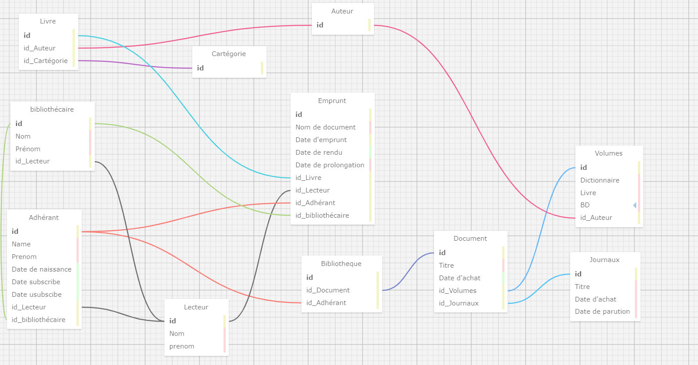
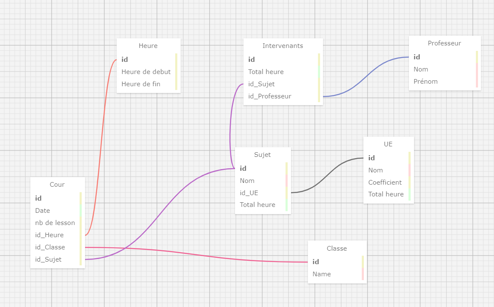

# Exercices ORT
Voici les exercices du projet base de donnée que j'ai realiser

Ceci est la representation graphique de l'exercices 1

Ceci est la representation graphique de l'exercices 2

Ceci est la representation graphique de l'exercices 3

Ceci est la representation graphique de l'exercices 4

